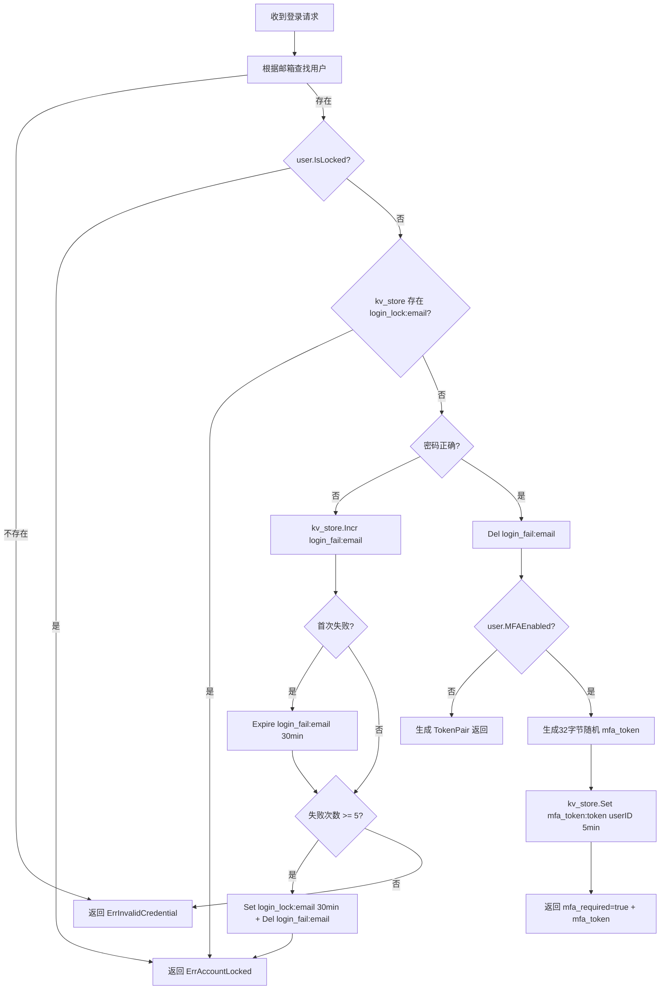
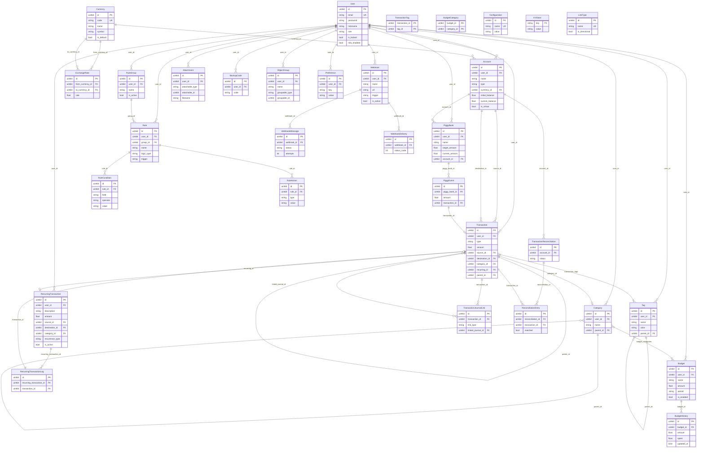

# Zero-Life 技术文档

## 1. 项目概述

Zero-Life 是一个个人财务管理系统，基于复式记账法，使用 Go + Vue 重写 Firefly III。支持多币种、预算管理、循环交易、规则引擎、Webhook、数据导入导出等功能。

- **后端**：Go 1.26.1 + Gin + GORM + SQLite
- **前端**：Vue 3 + TypeScript + Vite + Element Plus
- **部署**：Docker Compose（API :8080 + Web :80）

## 2. 项目结构

```
zero-life/
├── server/                    # 后端 Go 项目
│   ├── cmd/server/            # 入口
│   │   ├── main.go            # 依赖注入 + 启动（287行）
│   │   └── config.yaml        # 运行时配置
│   ├── internal/
│   │   ├── config/            # Viper 配置加载
│   │   ├── controller/        # HTTP 处理器（32个文件）
│   │   ├── dto/
│   │   │   ├── request/       # 请求 DTO（24个文件）
│   │   │   └── response/      # 响应 DTO（25个文件）
│   │   ├── middleware/        # 中间件（5个文件）
│   │   ├── model/             # GORM 数据模型（21个文件）
│   │   ├── pkg/               # 共享包（8个子包）
│   │   │   ├── errcode/       # 统一错误码
│   │   │   ├── jwt/           # JWT 工具
│   │   │   ├── pagination/    # 分页工具
│   │   │   ├── totp/          # TOTP 工具
│   │   │   ├── validator/     # 自定义验证
│   │   │   ├── webhook/       # Webhook 发送
│   │   │   ├── email/         # 邮件发送
│   │   │   └── hash/          # 哈希工具
│   │   ├── repository/        # 数据访问层（22个文件）
│   │   ├── router/            # 路由注册
│   │   │   └── router.go      # 所有 API 路由（456行）
│   │   └── service/           # 业务逻辑层（29个文件）
│   ├── docs/                  # Swagger 生成文档
│   ├── Dockerfile             # 多阶段构建
│   └── go.mod                 # Go 模块
├── web/                       # 前端 Vue 项目
│   ├── src/
│   │   ├── api/               # API 层（25个文件）
│   │   ├── assets/            # 静态资源
│   │   ├── components/        # 可复用组件
│   │   │   ├── charts/        # 图表组件（Bar/Line/Pie）
│   │   │   ├── common/        # 通用组件（AmountInput/ColorPicker/DateRangePicker 等）
│   │   │   └── layout/        # 布局组件（Header/Layout/Sidebar）
│   │   ├── i18n/              # 国际化（中/英）
│   │   ├── pages/             # 页面组件（21个目录，30个 Vue 文件）
│   │   ├── router/            # Vue Router
│   │   ├── stores/            # Pinia 状态管理（6个文件）
│   │   ├── types/             # TypeScript 类型（24个文件）
│   │   └── utils/             # 工具函数（request/format/decimal）
│   ├── Dockerfile             # 多阶段构建
│   ├── nginx.conf             # Nginx 配置
│   └── package.json
├── doc/                       # 文档目录
├── docker-compose.yml         # Docker Compose 编排
├── .env.example               # 环境变量示例
└── AGENTS.md                  # AI 助手上下文文档
```

## 3. 后端架构

### 3.1 分层架构

```
Controller（HTTP 处理）→ Service（业务逻辑）→ Repository（数据访问）→ GORM Model（数据库）
```

- **Controller**：接收 HTTP 请求，参数绑定和校验，调用 Service，返回统一响应格式
- **Service**：核心业务逻辑，事务管理，跨 Repository 协调
- **Repository**：GORM 数据访问，提供 `WithDB` 后缀方法接受外部事务
- **Model**：GORM 模型定义，对应数据库表

### 3.2 依赖注入

`main.go` 手动依赖注入（无 DI 框架），启动顺序：

1. 加载配置（Viper + 环境变量覆盖）
2. 初始化日志（Zap）
3. 初始化数据库（SQLite + WAL + AutoMigrate 25 张表），创建写库（1连接）和读库（100只读连接）两个实例
4. 创建 Repository 实例（22个），每个注入 readDB + writeDB
5. 创建 Service 实例（28个），注入依赖
6. 初始化默认货币
7. 创建 Controller 实例（27个）
8. 初始化 Gin 引擎 + 注册路由
9. 启动定时任务调度器
10. 启动 HTTP 服务器

### 3.3 统一响应格式

```json
{
  "code": 0,
  "message": "success",
  "data": { ... }
}
```

通过 `controller.Success()` / `controller.Error()` 返回。

### 3.4 数据库

- **引擎**：SQLite + WAL 模式
- **读写分离**：写库 `max_open_conns=1`（单写串行保证安全），读库 `?mode=ro` 只读连接 `max_open_conns=100`（利用 WAL 并发读）
- **Repository 层**：每个 Repository 持有 `readDB` 和 `writeDB` 两个 `*gorm.DB` 实例，读方法用 `readDB`，写方法用 `writeDB`，混合读写方法（如 UpsertHistory、Incr、Set 等）用 `writeDB` 保证一致性
- **KVRepository 特殊**：所有方法（含 Get/Exists）均使用 `writeDB`，因为 `cleanExpired()` 惰性清理有写副作用
- **WithDB 方法**：接受外部事务参数，不使用 `readDB`/`writeDB`，保证事务内操作在同一连接上执行
- **迁移**：启动时 GORM AutoMigrate，无手动迁移文件
- **金额**：`decimal(19,4)` 类型，Go 用 `shopspring/decimal`，禁止浮点数

### 3.5 认证

- **JWT 双 Token**：AccessToken（15min）+ RefreshToken（168h/7天）
- **中间件**：`middleware.Auth` 解析 Bearer Token，注入 `user_id`/`email` 到 Gin 上下文
- **管理员**：`middleware.Admin` 查数据库校验 `Role == "admin"`，注入 `role`
- **前端续期**：401 → 用 RefreshToken 调 `/auth/refresh` → 重发请求

### 3.6 限流

使用 `kv_store` 表模拟 Redis KV 存储，`ratelimit:<IP>` 键计数，TTL 过期，超限返回 429。

### 3.7 定时任务

内置 `robfig/cron` 调度器：

| 任务 | 周期 | 说明 |
|------|------|------|
| 循环交易处理 | 每天 00:00 | 执行到期循环交易，生成交易记录 |
| 预算历史快照 | 每天 09:00 | 为近2年已结束周期生成/更新快照 |
| WAL 检查点 | 每6小时 | 执行 `PRAGMA wal_checkpoint(TRUNCATE)`，将 WAL 文件合并回主数据库 |

管理员可通过 `POST /api/v1/cron/:id/run` 手动触发。

## 4. 前端架构

### 4.1 技术栈

- Vue 3 + Composition API + `<script setup>`
- TypeScript + Vite
- Element Plus UI 组件库
- Pinia 状态管理
- vue-i18n 国际化（中/英）
- vue-router 路由（懒加载）
- Axios HTTP 客户端（自动 Token 刷新）
- ECharts 图表
- decimal.js 金额计算

### 4.2 路径别名

`@` → `src/`

### 4.3 状态管理

6 个 Pinia Store：`account`、`app`、`auth`、`category`、`currency`、`tag`

### 4.4 API 层

每个领域一个文件（25个），使用 `src/utils/request.ts`（Axios 封装，自动刷新 Token，401 重试队列）。

### 4.5 认证守卫

`router/index.ts` 中全局前置守卫：未认证重定向到 `/login`，已认证访问公开页重定向到 `/`。

## 5. 数据模型

### 5.1 核心业务模型

| 模型 | 表名 | 说明 |
|------|------|------|
| User | users | 用户（邮箱+密码+角色+MFA） |
| Account | accounts | 账户（asset/expense/revenue/liability 四种类型） |
| Transaction | transactions | 交易（deposit/withdrawal/transfer） |
| Category | categories | 分类（最多5级树形结构） |
| Tag | tags | 标签（最多5级树形结构） |
| Budget | budgets | 预算（关联分类，跟踪支出） |
| BudgetHistory | budget_history | 预算历史快照 |
| Currency | currencies | 货币 |
| ExchangeRate | exchange_rates | 汇率 |
| PiggyBank | piggy_banks | 储蓄罐 |
| PiggyEvent | piggy_events | 储蓄罐存取事件 |
| RecurringTransaction | recurring_transactions | 循环交易 |
| RecurringTransactionLog | recurring_transaction_logs | 循环交易执行日志 |

### 5.2 辅助模型

| 模型 | 表名 | 说明 |
|------|------|------|
| RuleGroup | rule_groups | 规则组 |
| Rule | rules | 规则（含条件和动作） |
| RuleCondition | rule_conditions | 规则条件 |
| RuleAction | rule_actions | 规则动作 |
| Webhook | webhooks | Webhook 配置 |
| WebhookDelivery | webhook_deliveries | Webhook 投递记录 |
| Attachment | attachments | 附件 |
| LinkType | link_types | 交易关联类型 |
| TransactionJournalLink | transaction_journal_links | 交易关联 |
| ObjectGroup | object_groups | 对象分组 |
| Preference | preferences | 用户偏好 |
| Configuration | configurations | 系统配置 |
| Reconciliation | reconciliations | 对账 |
| ReconciliationEntry | reconciliation_entries | 对账条目 |
| KVStore | kv_store | KV 存储（替代 Redis） |
| BackupCode | backup_codes | MFA 备用码 |

### 5.3 中间表

| 表名 | 复合主键 | 说明 |
|------|---------|------|
| transaction_tags | (TransactionID, TagID) | 交易-标签多对多 |
| budget_categories | (BudgetID, CategoryID) | 预算-分类多对多 |

## 6. API 路由

### 6.1 公开路由（无需 Token）

| 端点 | 方法 | 说明 |
|------|------|------|
| `/api/v1/auth/register` | POST | 注册 |
| `/api/v1/auth/login` | POST | 登录 |
| `/api/v1/auth/refresh` | POST | 刷新 Token |
| `/api/v1/auth/forgot-password` | POST | 忘记密码 |
| `/api/v1/auth/reset-password` | POST | 重置密码 |
| `/api/v1/auth/mfa-verify` | POST | MFA 登录验证 |

### 6.2 认证后路由

**认证**：`/api/v1/auth/profile`(GET/PUT)、`/api/v1/auth/password`(PUT)

**账户**：`/api/v1/accounts` — CRUD

**交易**：`/api/v1/transactions` — CRUD + 搜索 + 拆分/合并

**批量操作**：`/api/v1/transactions/bulk` — 批量编辑/删除/转换/克隆

**分类**：`/api/v1/categories` — CRUD（树形返回）

**标签**：`/api/v1/tags` — CRUD（树形返回）

**预算**：`/api/v1/budgets` — CRUD + 历史快照

**货币**：`/api/v1/currencies` — 列表 + 状态/默认切换 + 汇率

**规则**：`/api/v1/rules` — CRUD + 切换/执行

**规则组**：`/api/v1/rule-groups` — CRUD + 执行

**报表**：`/api/v1/reports` — 收支/分类/预算/净值/趋势/标签/审计

**导入**：`/api/v1/imports` — 上传/解析/执行

**仪表盘**：`/api/v1/dashboard` — GET

**储蓄罐**：`/api/v1/piggy-banks` — CRUD + 存入/取出/事件/排序/重置

**附件**：`/api/v1/attachments` — 上传/下载/查看/列表/删除

**自动补全**：`/api/v1/autocomplete` — 账户/分类/标签/货币/预算/循环交易

**导出**：`/api/v1/exports` — 交易/账户/预算/分类/标签

**循环交易**：`/api/v1/recurring-transactions` — CRUD + 处理到期

**Webhook**：`/api/v1/webhooks` — CRUD + 投递记录

**对象分组**：`/api/v1/object-groups` — CRUD

**交易关联**：`/api/v1/transaction-links` — 创建/列表/删除

**偏好**：`/api/v1/preferences` — 列表/获取/设置/删除

**对账**：`/api/v1/reconciliations` — CRUD

**图表**：`/api/v1/chart` — 账户/预算/分类/标签/交易趋势

**洞察**：`/api/v1/insight` — 支出/收入/转账

**MFA**：`/api/v1/mfa` — 设置/启用/禁用/验证/状态/备用码

**关联类型**：`/api/v1/link-types` — CRUD

**健康检查**：`/api/v1/health` — GET

### 6.3 管理员路由

**用户管理**：`/api/v1/users` — 列表/详情/更新/删除/角色变更/锁定/解锁

**系统管理**：`/api/v1/admin` — 配置列表/获取/更新/测试邮件/用户管理/邀请

**定时任务**：`/api/v1/cron` — 列表/手动执行

## 7. 前端路由

### 7.1 公开页面

| 路径 | 页面 |
|------|------|
| `/login` | 登录 |
| `/register` | 注册 |
| `/reset-password` | 重置密码 |

### 7.2 认证后页面

| 路径 | 页面 |
|------|------|
| `/` | 仪表盘 |
| `/accounts` | 账户列表 |
| `/accounts/create` | 创建账户 |
| `/accounts/:id/edit` | 编辑账户 |
| `/transactions` | 交易列表 |
| `/transactions/create` | 创建交易 |
| `/transactions/:id/edit` | 编辑交易 |
| `/categories` | 分类管理 |
| `/tags` | 标签管理 |
| `/budgets` | 预算列表 |
| `/budgets/:id` | 预算详情 |
| `/reports/income-expense` | 收支报表 |
| `/reports/category` | 分类报表 |
| `/reports/budget` | 预算报表 |
| `/reports/net-worth` | 净值报表 |
| `/reports/trend` | 趋势报表 |
| `/reports/tag` | 标签报表 |
| `/piggy-banks` | 储蓄罐 |
| `/recurring-transactions` | 循环交易 |
| `/webhooks` | Webhook |
| `/exports` | 数据导出 |
| `/attachments` | 附件管理 |
| `/reconciliations` | 对账 |
| `/imports` | 数据导入 |
| `/rules` | 规则引擎 |
| `/object-groups` | 对象分组 |
| `/transaction-links` | 交易关联 |
| `/cron` | 定时任务管理 |
| `/settings/profile` | 个人设置 |
| `/settings/currencies` | 货币设置 |
| `/settings/mfa` | MFA 设置 |
| `/settings/users` | 用户管理 |
| `/settings/preferences` | 偏好设置 |

## 8. 错误码

按模块分段定义在 `internal/pkg/errcode/errcode.go`：

| 段 | 模块 | 示例 |
|----|------|------|
| 0 | 成功 | `ErrSuccess` (0) |
| 400-499 | HTTP 标准 | `ErrBadRequest` (400)、`ErrNotFound` (404) |
| 1xxxx | 认证 | `ErrInvalidCredential` (10002)、`ErrAccountLocked` (10003) |
| 2xxxx | 账户 | `ErrAccountNameExists` (20001)、`ErrAccountHasTxns` (20003) |
| 3xxxx | 交易 | `ErrInvalidAmount` (30001)、`ErrSameAccount` (30004) |
| 4xxxx | 分类 | `ErrCategoryNameExists` (40001)、`ErrCategoryTooDeep` (40002) |
| 5xxxx | 标签 | `ErrTagNameExists` (50001)、`ErrTagTooDeep` (50003) |
| 6xxxx | 预算 | `ErrBudgetAmountInvalid` (60001)、`ErrBudgetCategoryInvalid` (60002)、`ErrBudgetCategoryRequired` (60003) |
| 7xxxx | 循环交易 | `ErrRecurringAmountInvalid` (70001) |
| 8xxxx | 规则 | `ErrRuleConditionInvalid` (80001) |
| 9xxxx | 导入 | `ErrImportFileInvalid` (90001) |
| 10xxxx | 定期交易 | `ErrRecurringTransactionInvalid` (100003) |
| 11xxxx | Webhook | `ErrWebhookURLInvalid` (110001) |
| 12xxxx | 对象组 | `ErrObjectGroupNameExists` (120001) |
| 13xxxx | 交易链接 | `ErrTransactionLinkInvalid` (130001) |
| 14xxxx | 偏好 | `ErrPreferenceInvalid` (140001) |
| 15xxxx | 对账 | `ErrReconciliationNotOpen` (150002) |
| 16xxxx | MFA | `ErrMFAInvalidCode` (160003) |

## 9. 配置

### 9.1 后端配置（config.yaml）

```yaml
app:
  env: development          # 环境：development/production
  port: "8080"              # 服务端口
db:
  path: "./data/zero-life.db"  # SQLite 数据库路径
  max_idle_conns: 1         # 写库最大空闲连接数（SQLite 单写模式）
  max_open_conns: 1         # 写库最大打开连接数
  max_lifetime: 0s          # 连接最大生命周期
  read_max_idle_conns: 10   # 读库最大空闲连接数
  read_max_open_conns: 100  # 读库最大打开连接数（?mode=ro 只读，利用 WAL 并发读）
jwt:
  secret: "change-me-in-production"  # JWT 签名密钥
  access_token_ttl: 15m     # Access Token 有效期
  refresh_token_ttl: 168h   # Refresh Token 有效期（7天）
smtp:
  host: ""                  # SMTP 服务器
  port: 587                 # SMTP 端口
  user: ""                  # SMTP 用户名
  password: ""              # SMTP 密码
  from: ""                  # 发件人地址
cors:
  allow_origins:            # 允许的跨域来源
    - "http://localhost:5173"
log:
  level: debug              # 日志级别
  format: json              # 日志格式
attach:
  path: "./data/attachments"  # 附件存储路径
```

所有配置项支持环境变量覆盖（`viper.AutomaticEnv()`）。

### 9.2 Docker 环境变量

| 变量 | 默认值 | 说明 |
|------|--------|------|
| `JWT_SECRET` | `change-me-in-production` | JWT 签名密钥 |
| `APP_ENV` | `production` | 运行环境 |
| `GIN_MODE` | `release` | Gin 模式 |

## 10. 部署

### 10.1 开发环境

```bash
# 后端（在 server/ 目录下）
go run ./cmd/server/          # :8080

# 前端（在 web/ 目录下）
npm run dev                   # :5173（Vite 代理 /api → :8080）
```

### 10.2 Docker Compose

```bash
docker compose up -d          # api(:8080) + web(:80)
docker compose up -d --build  # 代码更新后重新构建
```

- **API 容器**：`golang:1.22-alpine` 构建 → `alpine:3.19` 运行，CGO 编译
- **Web 容器**：`node:20-alpine` 构建 → `nginx:1.24-alpine` 运行
- **Nginx**：SPA 回退 + `/api/` 反向代理到 `http://api:8080`
- **数据卷**：`sqlite_data` 持久化数据库文件

### 10.3 Swagger

```bash
# 在 server/ 目录下
swag init -g cmd/server/main.go -o docs --outputTypes go,json
```

访问 `http://localhost:8080/swagger/index.html`

## 11. 中间件

| 中间件 | 文件 | 说明 |
|--------|------|------|
| CORS | `cors.go` | 跨域处理，检查 `AllowOrigins` 配置 |
| Auth | `auth.go` | JWT Bearer Token 认证，注入 `user_id`/`email` |
| Admin | `admin.go` | 管理员角色校验，查数据库确认 `Role == "admin"` |
| RateLimit | `ratelimit.go` | IP 限流，基于 `kv_store` 表，超限返回 429 |
| Logger | `logger.go` | 请求日志（Zap），记录方法/路径/状态码/延迟 |

## 12. 关键业务规则

### 12.1 复式记账

- 每笔交易通过 `source_id` 和 `destination_id` 引用两个账户
- 四种账户类型：asset（资产）、expense（支出）、revenue（收入）、liability（负债）
- 三种交易类型：deposit（存款）、withdrawal（取款）、transfer（转账）
- 资产/负债账户追踪余额，收入/支出账户仅作分类

### 12.2 余额计算

余额变更按账户类型决定方向：

| 账户类型 | 作为 source | 作为 destination |
|----------|------------|-----------------|
| asset | `-amount`（钱流出） | `+amount`（钱流入） |
| liability | `+amount`（欠款增加） | `-amount`（欠款减少） |
| revenue | 不更新 | 不适用 |
| expense | 不适用 | 不更新 |

### 12.3 分类/标签

- 最多5级树形结构，通过 `parent_id` 形成层级
- 选中父分类/标签时自动包含子分类/标签的交易
- O(n) 两遍扫描构建树，使用指针切片避免值语义丢失

### 12.4 预算管理

#### 核心概念

预算用于设定分类支出上限，跟踪每个周期的支出使用情况。支持日度、周度、月度、季度、年度五种周期。一个预算可关联多个分类（多对多），选择父分类时自动包含子分类的支出。

#### 数据模型

**Budget** (`model/budget.go`)

| 字段 | 类型 | 说明 |
|------|------|------|
| ID | uint64 | 主键自增 |
| UserID | uint64 | 所属用户，索引，数据隔离 |
| Name | string (size:100) | 预算名称 |
| Amount | decimal(19,4) | 预算金额上限 |
| Period | string (size:20) | 预算周期：daily/weekly/monthly/quarterly/yearly |
| IsEnabled | bool (default:true) | 是否启用，禁用时不跟踪支出 |
| Categories | []Category | 多对多关联，通过 budget_categories 中间表 |
| DeletedAt | gorm.DeletedAt | 软删除 |

**BudgetCategory** (`model/budget.go`)：多对多关联表，复合主键 `(BudgetID, CategoryID)`，纯关联表无额外字段。

**BudgetHistory** (`model/budget.go`)

| 字段 | 类型 | 说明 |
|------|------|------|
| ID | uint64 | 主键自增 |
| BudgetID | uint64 | 关联预算ID，索引 |
| PeriodStart | time.Time | 周期开始日期 |
| PeriodEnd | time.Time | 周期结束日期 |
| Amount | decimal(19,4) | 该周期的预算金额 |
| Spent | decimal(19,4) | 该周期的实际支出 |
| CreatedAt | time.Time | 创建时间 |
| UpdatedAt | time.Time | 更新时间 |

**唯一索引**：`idx_budget_history_budget_period` — `(budget_id, period_start)` 联合唯一索引，确保同一预算同一周期只有一条快照记录

#### API 端点

| 端点 | 方法 | 说明 |
|------|------|------|
| `/api/v1/budgets` | POST | 创建预算 |
| `/api/v1/budgets` | GET | 列表（含使用率计算） |
| `/api/v1/budgets/:id` | GET | 详情（含使用率计算） |
| `/api/v1/budgets/:id` | PUT | 更新（名称/金额/周期/启用状态/分类） |
| `/api/v1/budgets/:id` | DELETE | 删除（级联删除关联和历史） |
| `/api/v1/budgets/:id/history` | GET | 历史快照列表 |

#### 请求/响应 DTO

**CreateBudgetReq**：`name`(必填)、`amount`(必填)、`period`(必填，oneof=daily/weekly/monthly/quarterly/yearly)、`category_ids`(必填，min=1)

**UpdateBudgetReq**：`name`(可选)、`amount`(可选)、`period`(可选，omitempty oneof)、`category_ids`(可选，nil=保留现有)、`is_enabled`(*bool，可选)

**BudgetResp**：`id`、`name`、`amount`(string, StringFixed(4))、`period`、`is_enabled`、`categories`([]CategoryResp)、`spent`(string)、`remaining`(string)、`usage_rate`(float64, 比率0~1+)、`status`(normal/warning/overspent)、`created_at`、`updated_at`

**BudgetHistoryResp**：`id`、`period_start`、`period_end`、`amount`(string)、`spent`(string)、`usage_rate`(float64, 比率0~1+)、`created_at`、`updated_at`

#### 业务规则

1. **金额校验**：创建和更新时金额必须大于零（`ErrBudgetAmountInvalid`，60001）
2. **分类关联**：创建时至少关联1个分类；更新时若未提供 `category_ids` 则保留现有分类（全量替换语义）
3. **分类校验**：`validateCategoryIDs` 会去重后校验所有分类ID存在且属于当前用户（`ErrBudgetCategoryInvalid`，60002；`ErrBudgetCategoryRequired`，60003）
4. **启用/禁用**：`is_enabled=false` 的预算跳过支出计算，返回零值
5. **级联删除**：删除预算时同时删除 `budget_categories` 关联 + `budget_history` 历史记录，事务保证原子性
6. **空字符串语义**：`UpdateBudgetReq` 中 `name`/`amount`/`period` 为空字符串表示"不修改"；`is_enabled` 使用 `*bool` 指针区分"未提供"和"设为false"

#### 支出计算 (`calculateSpent`)

1. 根据 `budgetPeriodRange(period, now)` 计算当前周期的起止时间
2. 收集预算关联的所有分类ID → 调用 `GetDescendantIDs` 展开子分类
3. 若展开后分类ID为空，返回零值（不查询交易）
4. 查询时间范围内、展开后分类下的 withdrawal 交易
5. 累加交易金额

`calculateSpent` 返回 `(decimal.Decimal, error)`，错误会向上传播到 `toRespWithUsage` 并返回 `errcode.ErrInternal`。`calculateSpentInRangeWithError` 同理，用于历史快照支出计算。

**`budgetPeriodRange` 函数**：根据周期类型计算起止时间，支持5种周期：
- daily：当天 00:00:00 ~ 23:59:59
- weekly：本周一 ~ 周日
- monthly：本月1日 ~ 月末
- quarterly：本季度首月1日 ~ 季末
- yearly：本年1月1日 ~ 12月31日

**使用场景**（5处支出计算，逻辑必须一致）：
- `BudgetService.calculateSpent`：预算列表/详情的使用率计算
- `BudgetService.calculateSpentInRangeWithError`：历史快照的支出计算
- `DashboardService.Get`：仪表盘预算预警
- `ChartService.BudgetSpending`：预算支出图表
- `ReportService.Budget`：预算报表

**错误处理**：所有5处支出计算均向上传播错误（不再静默吞错），`BudgetService.calculateSpent` 返回 `(decimal.Decimal, error)`，`DashboardService`/`ChartService`/`ReportService` 在 `GetDescendantIDs` 或 `ListAll` 失败时返回 `errcode.ErrInternal`。

#### 状态判定

使用率 ≥100% → `overspent`，≥80% → `warning`，<80% → `normal`。除零保护：金额为零时使用率为0。

**所有5处支出计算的状态判定均使用 decimal 比较**（非 float64），避免浮点精度问题：`usageRateDecimal.GreaterThanOrEqual(decimal.NewFromInt(1))` 和 `decimal.NewFromFloat(0.8)`。

#### 历史快照 (`SnapshotHistory`)

`CronService` 每天 09:00 执行，遍历所有启用预算，为近2年内所有已结束周期生成/更新快照（UPSERT），当前周期不生成（可看实时数据）。`UpsertHistory` 按 `budget_id + period_start` 判重，存在则只更新 `period_end`/`spent`，不更新 `amount`。

**Amount 保留策略**：已有快照的 `Amount` 不会被覆盖，保留该周期首次生成时的预算金额。只有新建快照时才写入当前预算金额。这样用户修改预算金额后，历史快照中的限额仍反映该周期实际设定的值。

**UpsertHistory 实现**：在事务中先查询 `WHERE budget_id = ? AND period_start = ?`，若 `errors.Is(err, gorm.ErrRecordNotFound)` 则创建新记录，否则更新已有记录。显式判断 `ErrRecordNotFound` 而非 `err != nil`，避免其他数据库错误被误判为"记录不存在"而创建重复记录。

#### 交易查询

支出计算、报表统计等场景使用 `TransactionRepository.ListAll` 方法，内部循环分页（每批 5000 条）查询直到取完所有数据，无条数限制。

#### 预算报表

`ReportService.Budget` 不接受日期范围参数（预算报表按各预算自身周期计算），控制器不绑定 `ReportReq`。前端 `BudgetReport.vue` 无日期范围选择器。

#### 前端实现

- **类型** (`types/budget.ts`)：`Budget` 接口含 `spent`/`remaining`/`usage_rate`/`status` 字段，`BudgetPeriod` 枚举定义5种周期
- **列表页** (`pages/budgets/BudgetListPage.vue`)：表格展示预算列表，含使用率进度条和状态标签；创建/编辑对话框含分类树形选择器；金额输入添加前端校验（`isNaN(numAmount) || numAmount <= 0`）；表单初始金额为空字符串
- **详情页** (`pages/budgets/BudgetDetailPage.vue`)：三卡片展示金额/已用/剩余；使用率进度条；分类标签；历史趋势折线图（LineChart）；当前周期关联交易列表（分页）
- **报表页** (`pages/reports/BudgetReport.vue`)：柱状图对比预算金额vs已用金额；明细表格；无日期范围选择器（预算报表按各预算自身周期计算，不接受日期范围参数）
- **无独立 Store**：预算页面直接调用 API，数据存在组件本地 ref 中

#### 错误码

| 错误码 | 常量 | 说明 |
|--------|------|------|
| 60001 | ErrBudgetAmountInvalid | 预算金额必须大于零 |
| 60002 | ErrBudgetCategoryInvalid | 关联分类ID无效（不存在/非本人） |
| 60003 | ErrBudgetCategoryRequired | 创建/更新预算时至少关联1个分类 |

### 12.5 储蓄罐

- 虚拟记账，存取不修改关联账户余额，不创建交易记录
- 存入时双重校验：不超过目标金额 + 关联账户余额足够（减去同账户所有储蓄罐已存总额）
- 取出时仅校验不超过当前已存金额（取出是释放虚拟锁定，永远合理）
- 多个储蓄罐可绑定同一账户，存入时考虑同账户所有储蓄罐的已存总额
- 账户余额下降导致超额时，系统不自动修正，下次存入被阻止，用户需先取出

### 12.6 循环交易

- 支持日/周/月/年重复规则
- 每天 00:00 自动处理到期交易
- 自动推进下次到期日

### 12.7 规则引擎

- 规则组包含多条规则，支持 AND/OR 逻辑
- 触发时机：`on_create`（交易创建后）、`on_update`（交易更新后）
- 条件字段：描述/金额/账户/分类/标签/类型/日期等
- 动作类型：设置分类/添加标签/设置备注/追加备注等

### 12.8 Webhook

- 触发时机：`TRANSACTION_CREATE`、`TRANSACTION_UPDATE`、`TRANSACTION_DELETE`
- 事务提交后异步触发，避免事务回滚导致误通知
- 记录投递历史（请求体/响应码/响应体/重试次数）

### 12.9 用户认证

- 首个注册用户自动成为管理员
- 登录失败 ≥5 次锁定30分钟（基于 `kv_store`）
- 支持 TOTP 双因素认证（自研实现，兼容 Google Authenticator）
- 密码重置令牌24小时有效，一次性使用

## 13. 用户认证体系

### 13.1 整体架构

```
请求 → RateLimit中间件 → Auth中间件 → Admin中间件(可选) → Controller → Service → Repository
         ↓                  ↓              ↓
       kv_store限流      JWT解析验证    查库校验角色
```

**核心组件**：
- `middleware/ratelimit.go`：IP 限流，基于 kv_store 滑动窗口
- `middleware/auth.go`：JWT Bearer Token 解析，注入 `user_id`/`email` 到 Gin 上下文
- `middleware/admin.go`：查数据库校验 `user.Role == "admin"`，注入 `role` 到上下文
- `pkg/jwt/jwt.go`：JWT 令牌生成与解析（HMAC-SHA256）
- `pkg/totp/totp.go`：TOTP 自研实现（HMAC-SHA1，30秒窗口，6位码，±1步长容错）
- `service/auth_service.go`：注册、登录、密码重置、MFA 登录验证
- `service/mfa_service.go`：MFA 设置/启用/禁用/备用码管理
- `repository/kv_repository.go`：kv_store 表替代 Redis，用于限流/锁定/令牌存储

### 13.2 JWT 双 Token 机制

**Claims 结构**：

| 字段 | 类型 | 说明 |
|------|------|------|
| UserID | uint64 | 用户ID |
| Email | string | 用户邮箱 |
| TokenType | string | 令牌类型：`access` 或 `refresh` |
| ExpiresAt | time | 过期时间 |
| IssuedAt | time | 签发时间 |

**双 Token 对比**：

| 属性 | AccessToken | RefreshToken |
|------|------------|-------------|
| 有效期 | 15分钟 | 168小时（7天） |
| TokenType | `access` | `refresh` |
| 用途 | API 请求认证 | 续期获取新 TokenPair |
| 携带频率 | 每个请求 | 仅续期时 |
| 泄露风险 | 高（频繁传输） | 低（仅续期时传输） |

**安全机制**：
- `ParseAccessToken` 校验 `token_type == "access"`，RefreshToken 不能当作 AccessToken 使用
- `ParseRefreshToken` 校验 `token_type == "refresh"`，AccessToken 不能用于续期
- 签名算法 HMAC-SHA256，密钥相同（`config.jwt.secret`）

**前端自动续期**（`web/src/utils/request.ts`）：
1. 请求返回 401 → 检查是否有 refreshToken
2. 无 refreshToken → 登出，跳转登录页
3. 有 refreshToken → 用 `axios.post`（非 `service`，避免循环拦截）调 `POST /auth/refresh`
4. 刷新期间其他 401 请求加入 `pendingRequests` 队列等待
5. 刷新成功 → 更新 authStore Token → 通知队列用新 Token 重发 → 自己也重发
6. 刷新失败 → 登出，跳转登录页
7. `isRefreshing` 标志防止并发刷新，`_retry` 标志防止无限循环

### 13.3 注册流程

```
POST /api/v1/auth/register
请求：{ email, password(min=8), nickname }
响应：{ access_token, refresh_token, expires_at }
```

1. 检查邮箱唯一 → 已存在返回 `ErrEmailExists`
2. bcrypt(cost=10) 加密密码
3. 判断是否首个用户：`authRepo.Count() == 0` 则 `Role = "admin"`
4. 创建用户记录
5. 生成 TokenPair 返回（注册即登录）

### 13.4 登录流程（含暴力破解防护 + MFA）

```
POST /api/v1/auth/login
请求：{ email, password }
```



**kv_store 键说明**：

| 键格式 | 值 | TTL | 说明 |
|--------|-----|-----|------|
| `login_fail:{email}` | 失败次数 | 30min | 登录失败计数器 |
| `login_lock:{email}` | "1" | 30min | 临时锁定标记 |
| `mfa_token:{token}` | userID | 5min | MFA 登录临时令牌 |

**安全设计**：
- 用户不存在返回 `ErrInvalidCredential`（不暴露"用户不存在"）
- 管理员手动锁定（`IsLocked`）和临时锁定（kv_store）双重检查
- 连续失败5次锁定30分钟，锁定后删除计数器（解锁后重新计数）

### 13.5 MFA 登录二次验证

```
POST /api/v1/auth/mfa-verify
请求：{ mfa_token, code }
响应：{ access_token, refresh_token, expires_at }
```

1. 从 kv_store 取出 `mfa_token:{token}` → 获取 userID
2. 查找用户，验证 MFA 已启用
3. 调用 `totp.ValidateCode(secret, code)` 验证 TOTP 码 → 失败则尝试备用码
4. 验证通过 → 删除临时令牌（一次性）→ 生成真正的 TokenPair 返回

### 13.6 MFA 管理

**基于 TOTP，使用自研实现（`pkg/totp/totp.go`），兼容 Google Authenticator**

| 端点 | 方法 | 说明 |
|------|------|------|
| `/api/v1/mfa/setup` | POST | 生成密钥 + `otpauth://totp` URL |
| `/api/v1/mfa/enable` | POST | 验证 TOTP 码后启用，生成10个备用码 |
| `/api/v1/mfa/disable` | POST | 验证码后禁用，清除密钥+备用码 |
| `/api/v1/mfa/verify` | POST | 验证 TOTP 码（登录后验证） |
| `/api/v1/mfa/status` | GET | 查询 MFA 启用状态 |
| `/api/v1/mfa/backup-codes` | POST | 重新生成备用码（旧码全部失效） |

**TOTP 自研实现**（`pkg/totp/totp.go`）：

| 函数 | 说明 |
|------|------|
| `GenerateSecret()` | 生成 20 字节随机密钥，Base32 编码（无 padding） |
| `GenerateQRCodeURL(account, issuer, secret)` | 生成 `otpauth://totp/{issuer}:{account}?secret={secret}&issuer={issuer}` URL |
| `ValidateCode(secret, code)` | 验证 6 位 TOTP 码，支持 ±1 步长容错（前后 30 秒） |

**TOTP 算法**（符合 RFC 6238）：

```
1. 密钥：20字节随机数，Base32编码存储
2. 时间步长：当前Unix时间戳 / 30（每30秒变化一次）
3. HMAC-SHA1：用密钥对时间步长(8字节大端)做HMAC运算，得到20字节哈希
4. 截断：取哈希最后一个字节的低4位作为偏移量offset，从offset取4字节，与0x7fffffff做与运算去符号位
5. 取模：结果对1000000取模，前补0得到6位数字码
6. 容错：验证时检查当前步长±1（前后30秒内的码都有效）
```

**Setup 流程**：
1. 检查未启用 MFA
2. 调用 `totp.GenerateSecret()` 生成密钥
3. 调用 `totp.GenerateQRCodeURL()` 生成二维码 URL
4. 临时保存密钥到 `user.mfa_secret`（此时 `mfa_enabled=false`）

**Enable 流程**：
1. 检查未启用 + 有密钥
2. 调用 `totp.ValidateCode(secret, code)` 验证 TOTP 码
3. 设置 `mfa_enabled=true`
4. 生成 10 个备用码（格式 `XXXX-XXXX`，8位大写字母数字），bcrypt 哈希存储，明文仅此一次返回

**Disable 流程**：
1. 调用 `totp.ValidateCode()` 验证 TOTP 码，失败则尝试备用码
2. 设置 `mfa_enabled=false` + 清除 `mfa_secret` + 删除所有备用码

**备用码**：
- 格式：`XXXX-XXXX`（5字节随机数 Base32 编码取前8位，中间加分隔符）
- 存储：bcrypt 哈希，验证时逐个比对
- 使用：TOTP 验证失败时自动尝试备用码，验证通过后标记 `used_at`
- 重新生成：旧码全部删除，生成新码

**MFAService 直接使用 `db`（writeDB）更新 MFA 字段**，不走 Repository 的 `Update` 方法，因为需要精确更新 `mfa_secret`/`mfa_enabled` 等字段。

### 13.7 密码重置

```
POST /api/v1/auth/forgot-password  → 发送重置邮件
POST /api/v1/auth/reset-password   → 用令牌重置密码
```

**ForgotPassword 流程**：
1. 查找用户（不存在也返回 nil，防止邮箱枚举攻击）
2. 生成 32 字节随机 token
3. `kv_store.Set(reset_token:{token}, userID, 24h)`
4. 发送重置邮件（发送失败不阻断，令牌仍有效）

**ResetPassword 流程**：
1. `kv_store.Get(reset_token:{token})` → 取出 userID
2. 验证用户存在
3. bcrypt 加密新密码 → 更新
4. `kv_store.Del(key)` 删除令牌（一次性使用）

### 13.8 请求限流

`middleware/ratelimit.go` 基于 kv_store 实现滑动窗口限流：

- 键格式：`ratelimit:{IP}`
- 首次请求：`Incr` 计数 → `Expire` 设置窗口过期
- 超限：返回 429 Too Many Requests
- 降级策略：kv_store 操作失败时放行请求（不因限流故障阻断正常访问）

### 13.9 管理员权限

`middleware/admin.go` 挂载在 `/users/*` 路由组：

1. 从 Gin 上下文取 `user_id`（必须先经过 Auth 中间件）
2. 查数据库获取用户 → 校验 `Role == "admin"`
3. 非管理员返回 403 Forbidden
4. 管理员注入 `role` 到上下文

**管理员 API**：

| 端点 | 方法 | 说明 |
|------|------|------|
| `/api/v1/users` | GET | 用户列表 |
| `/api/v1/users/:id` | GET/PUT/DELETE | 用户详情/更新/软删除 |
| `/api/v1/users/:id/role` | PUT | 变更角色（user ↔ admin） |
| `/api/v1/users/:id/lock` | POST | 锁定用户（`is_locked=true`） |
| `/api/v1/users/:id/unlock` | POST | 解锁用户 |

### 13.10 认证相关错误码

| 错误码 | 常量 | 说明 |
|--------|------|------|
| 10001 | ErrEmailExists | 邮箱已注册 |
| 10002 | ErrInvalidCredential | 邮箱或密码错误 |
| 10003 | ErrAccountLocked | 账户已锁定 |
| 10004 | ErrInvalidToken | 无效令牌 |
| 10005 | ErrOldPasswordWrong | 旧密码错误 |
| 160001 | ErrMFAAlreadyEnabled | MFA 已启用 |
| 160002 | ErrMFANotEnabled | MFA 未启用 |
| 160003 | ErrMFAInvalidCode | MFA 验证码错误 |
| 160004 | ErrMFAInvalidToken | MFA 令牌无效 |
| 160005 | ErrMFASetupNotFound | MFA 未初始化 |

## 14. 数据库设计

### 14.1 ER 关系图



### 14.2 表清单

| 表名 | 模型 | 说明 | 软删除 |
|------|------|------|--------|
| users | User | 用户 | 是 |
| accounts | Account | 账户（asset/expense/revenue/liability） | 是 |
| currencies | Currency | 货币 | 否 |
| exchange_rates | ExchangeRate | 汇率 | 否 |
| transactions | Transaction | 交易（deposit/withdrawal/transfer） | 模型定义有，实际硬删除 |
| categories | Category | 分类（最多5级树形） | 是 |
| tags | Tag | 标签（最多5级树形） | 是 |
| transaction_tags | TransactionTag | 交易-标签多对多中间表 | 否 |
| budgets | Budget | 预算 | 是 |
| budget_categories | BudgetCategory | 预算-分类多对多中间表 | 否 |
| budget_history | BudgetHistory | 预算历史快照（唯一索引：budget_id+period_start） | 否 |
| piggy_banks | PiggyBank | 储蓄罐 | 是 |
| piggy_events | PiggyEvent | 储蓄罐存取事件 | 否 |
| recurring_transactions | RecurringTransaction | 循环交易 | 是 |
| recurring_transaction_logs | RecurringTransactionLog | 循环交易执行日志 | 否 |
| rule_groups | RuleGroup | 规则组 | 是 |
| rules | Rule | 规则 | 是 |
| rule_conditions | RuleCondition | 规则条件 | 否 |
| rule_actions | RuleAction | 规则动作 | 否 |
| transaction_journal_links | TransactionJournalLink | 交易关联 | 否 |
| transaction_reconciliations | TransactionReconciliation | 对账 | 否 |
| reconciliation_entries | ReconciliationEntry | 对账条目 | 否 |
| webhooks | Webhook | Webhook 配置 | 是 |
| webhook_messages | WebhookMessage | Webhook 投递消息 | 否 |
| webhook_deliveries | WebhookDelivery | Webhook 投递记录 | 否 |
| attachments | Attachment | 附件（多态） | 是 |
| backup_codes | BackupCode | MFA 备用码 | 否 |
| configurations | Configuration | 系统配置（全局） | 否 |
| kv_store | KVStore | KV 存储（替代 Redis） | 否 |
| link_types | LinkType | 交易关联类型 | 是 |
| object_groups | ObjectGroup | 对象分组（多态） | 是 |
| preferences | Preference | 用户偏好 | 是 |

### 14.3 关系类型说明

| 关系类型 | 说明 | 示例 |
|----------|------|------|
| Belongs To | 多对一，外键在当前表 | Transaction.CategoryID → Category |
| Has Many | 一对多，外键在对方表 | User → Account（UserID） |
| Many2Many | 多对多，通过中间表 | Transaction ↔ Tag（transaction_tags） |
| Self-ref | 自引用，外键指向自身 | Category.ParentID → Category |
| Polymorphic | 多态，类型字段+ID字段 | Attachment（AttachableType + AttachableID） |

### 14.4 多态关系

**Attachment**（attachable_type + attachable_id）可关联：Transaction、Account、RecurringTransaction、Budget、Category、PiggyBank

**ObjectGroup**（groupable_type + groupable_id）可关联：Account、Category 等

### 14.5 唯一索引

| 表 | 索引名 | 字段 | 说明 |
|----|--------|------|------|
| users | - | email | 邮箱唯一 |
| accounts | idx_user_account_num_del | (user_id, account_number, deleted_at) | 用户内账户号唯一（含软删除） |
| currencies | - | code | 货币代码唯一（ISO 4217） |
| exchange_rates | idx_currency_pair | (from_currency_id, to_currency_id) | 货币对唯一 |
| configurations | - | name | 配置名唯一 |
| link_types | - | name | 关联类型名唯一 |
| preferences | idx_pref_user_key | (user_id, key) | 用户内偏好键唯一 |
| budget_history | idx_budget_history_budget_period | (budget_id, period_start) | 同一预算同一周期只有一条快照记录 |

### 14.6 复合主键

| 表 | 复合主键字段 | 说明 |
|----|-------------|------|
| budget_categories | (budget_id, category_id) | 预算-分类多对多中间表 |
| transaction_tags | (transaction_id, tag_id) | 交易-标签多对多中间表 |
| kv_store | key | 字符串主键 |

## 15. 分类管理

### 15.1 核心概念

分类采用**最多5级树形结构**：通过 `parent_id` 形成层级关系，最多5层深度。分类用于标记交易的支出/收入类别，也用于预算关联和报表统计。

**与标签的区别**：
- 分类和标签都支持最多5级树形结构
- 一个交易只能有一个分类，但可以有多个标签
- 分类用于预算控制，标签用于灵活标记

### 15.2 数据模型 (`model/category.go`)

| 字段 | 类型 | 说明 |
|------|------|------|
| ID | uint64 | 主键自增 |
| UserID | uint64 | 所属用户，索引，数据隔离 |
| Name | string (size:100) | 分类名称，用户内全局唯一 |
| ParentID | *uint64 (indexed) | 父分类ID，NULL = 一级分类 |
| Icon | string (size:50) | 图标标识 |
| Notes | text | 备注 |
| SortOrder | int (default:0) | 排序权重，越小越靠前 |
| Children | []Category | 虚拟字段，GORM `foreignKey:ParentID`，不持久化 |
| DeletedAt | gorm.DeletedAt | 软删除 |

### 15.3 API 端点

| 端点 | 方法 | 说明 |
|------|------|------|
| `/api/v1/categories` | POST | 创建分类 |
| `/api/v1/categories` | GET | 列表（返回树形结构） |
| `/api/v1/categories/:id` | GET | 详情 |
| `/api/v1/categories/:id` | PUT | 更新（仅 name/icon/notes/sort_order） |
| `/api/v1/categories/:id` | DELETE | 删除（级联删除子分类） |

### 15.4 请求/响应 DTO

**CreateCategoryReq**：`name`(必填)、`parent_id`(可选，null=一级)、`icon`、`notes`

**UpdateCategoryReq**：`name`、`icon`、`notes`、`sort_order`(*int，指针区分0和未设置)。**不含 `parent_id`**，不支持移动分类到其他父级。

**CategoryResp**：`id`、`name`、`parent_id`、`icon`、`notes`、`sort_order`、`children`(递归，omitempty)、`created_at`、`updated_at`。不含 `user_id`。

### 15.5 业务规则

1. **最多5级深度限制**：仅创建时校验。沿 parent 链向上计算深度，若新分类将超过5级则拒绝（`ErrCategoryTooDeep`，40002）。更新时不校验，因为 `UpdateCategoryReq` 不含 `parent_id`，无法改变层级。

2. **名称唯一性**：创建和更新时均校验。用户内全局唯一（非同父下唯一），通过加载全部分类后线性扫描检查。更新时仅在新名称与原名称不同时才校验。

3. **级联删除**：在数据库事务中执行。使用 `GetDescendantIDs` 收集所有后代分类ID（含自身），然后：置空所有被删分类关联交易的 `category_id` → 清理 `budget_categories` 关联表 → 删除所有后代分类及自身。

4. **空字符串语义**：`UpdateCategoryReq` 中 `name`/`icon`/`notes` 为空字符串表示"不修改"，无法主动清空为空字符串。`sort_order` 使用 `*int` 指针，可区分"未提供"和"设为0"。

### 15.6 树构建算法 (`buildTree`)

O(n) 两遍扫描，`Children` 使用 `[]*CategoryResp` 指针切片避免值副本导致深层子节点丢失：
1. 遍历所有分类，创建 `map[uint64]*CategoryResp` 用于 O(1) 查找
2. 遍历所有分类，将有 `parent_id` 的节点**指针**挂到父节点的 `Children` 上
3. 收集 `parent_id == nil` 的根节点

**值语义陷阱**：如果 `Children` 使用 `[]CategoryResp`（值切片），`append` 时子节点是值副本。当三级节点被挂到二级节点时，一级节点中已持有的二级节点副本的 `Children` 不会更新，导致三级及更深层节点丢失。改用 `[]*CategoryResp` 指针切片后，所有引用指向同一份数据，深层子节点正确显示。

**孤儿节点处理**：如果 `parent_id` 指向不存在的分类（被删除或数据不一致），该节点既不会出现在根节点中，也不会作为子节点，会被静默丢弃。

**排序**：`List` 查询使用 `ORDER BY sort_order ASC, id ASC`，树构建保持此顺序。

### 15.7 后代展开 (`GetDescendantIDs`)

迭代 BFS 算法：输入一组分类ID → 包含自身 → 查询 `WHERE parent_id IN (当前层)` → 收集子ID → 重复直到无更多子节点 → 返回所有ID（含输入）。

**使用场景**（5处）：
- `TransactionService.List`：按分类筛选交易时，选中父分类自动包含子分类的交易
- `BudgetService.calculateSpent`：计算预算支出时，展开关联分类的子分类
- `DashboardService`：仪表盘预算告警支出计算
- `ChartService`：报表分类图表数据聚合
- `CategoryService.Delete`：级联删除时收集所有后代

### 15.8 前端实现

- **类型** (`types/category.ts`)：`Category` 接口含递归 `children: Category[]`，与后端 `CategoryResp` 字段完全对齐
- **Store** (`stores/category.ts`)：仅缓存分类树，`fetchCategories()` 调用 `list()` API，失败时保持空数组
- **列表页** (`pages/categories/CategoryListPage.vue`)：使用 `el-tree` 展示树形结构，支持创建子分类（预填 `parent_id`）、编辑、删除
- **编辑限制**：编辑对话框不包含 `parent_id` 选择器和 `sort_order` 字段，与后端 `UpdateCategoryReq` 一致

### 15.9 错误码

| 错误码 | 常量 | 说明 |
|--------|------|------|
| 40001 | ErrCategoryNameExists | 分类名称已存在 |
| 40002 | ErrCategoryTooDeep | 分类层级超过5级 |

## 16. 标签管理

### 16.1 核心概念

标签采用**最多5级树形结构**：通过 `parent_id` 形成层级关系，最多5层深度。标签用于对交易进行灵活标记和分组，与分类互补。

**与分类的区别**：
- 分类和标签都支持最多5级树形结构
- 一个交易只能有一个分类，但可以有多个标签
- 分类用于预算控制，标签用于灵活标记

### 16.2 数据模型 (`model/tag.go`)

**Tag**：

| 字段 | 类型 | 说明 |
|------|------|------|
| ID | uint64 | 主键自增 |
| UserID | uint64 | 所属用户，索引，数据隔离 |
| Name | string (size:100) | 标签名称，用户内全局唯一 |
| Color | string (size:7, default:#409EFF) | 标签颜色，十六进制格式 |
| ParentID | *uint64 (indexed) | 父标签ID，NULL = 顶级标签 |
| DeletedAt | gorm.DeletedAt | 软删除 |

**TransactionTag** (`model/tag.go`)：多对多关联表，复合主键 `(TransactionID, TagID)`，纯关联表无额外字段。

### 16.3 API 端点

| 端点 | 方法 | 说明 |
|------|------|------|
| `/api/v1/tags` | POST | 创建标签 |
| `/api/v1/tags` | GET | 列表（返回树形结构） |
| `/api/v1/tags/:id` | GET | 详情 |
| `/api/v1/tags/:id` | PUT | 更新（名称、颜色、父标签ID） |
| `/api/v1/tags/:id` | DELETE | 删除（级联删除子标签） |

### 16.4 请求/响应 DTO

**CreateTagReq**：`name`(必填)、`color`(可选，默认 `#409EFF`)、`parent_id`(可选，null=顶级)

**UpdateTagReq**：`name`(可选)、`color`(可选)、`parent_id`(*uint64，可选)。**支持修改 `parent_id`**，可移动标签到其他父级。

**TagResp**：`id`、`name`、`color`、`parent_id`、`transaction_count`（关联交易数）、`children`(递归，omitempty)、`created_at`、`updated_at`。不含 `user_id`。

### 16.5 业务规则

1. **最多5级深度限制**：创建和更新时均校验。创建时沿 parent 链向上计算深度，若新标签将超过5级则拒绝（`ErrTagTooDeep`，50003）。更新时若指定了 `parent_id`，需满足三个条件：(a) 不能将自己设为自己的子标签；(b) 新父标签不能是当前标签的后代（防止循环）；(c) 新父标签深度 + 当前标签子树深度 ≤ 5。

2. **名称唯一性**：创建时校验。用户内全局唯一，通过加载全部标签后线性扫描检查。**更新时不校验名称唯一性**。

3. **级联删除**：获取所有后代标签ID（含自身），按从深到浅的顺序逐个调用 `tagRepo.Delete`（该方法内部有事务：先删 `transaction_tags` 关联，再删标签本身）。

4. **空字符串语义**：`UpdateTagReq` 中 `name`/`color` 为空字符串表示"不修改"，无法主动清空为空字符串。`parent_id` 使用 `*uint64` 指针，可区分"未提供"和"设为null（顶级）"。

### 16.6 树构建算法 (`buildTree`)

与分类的 `buildTree` 类似，但有两个差异：
1. **预计算交易数**：先遍历所有标签调用 `CountTransactions`，构建 `countMap`
2. **根节点使用值语义**：`roots` 是 `[]TagResp`（值切片），而非 `[]*TagResp`（指针切片）。子节点仍使用 `[]*TagResp` 指针切片挂载，根节点收集时解引用

**孤儿节点处理**：与分类相同，`parent_id` 指向不存在标签的节点被静默丢弃。

**排序**：`List` 查询使用 `ORDER BY id ASC`（无 sort_order 字段）。

### 16.7 后代展开 (`GetDescendantIDs`)

与分类完全相同的迭代 BFS 算法。

### 16.8 子树深度计算 (`getSubtreeDepth`)

更新标签 `parent_id` 时使用。BFS 逐层遍历子标签，计算以指定标签为根的子树最大深度（含自身）。

### 16.9 前端实现

- **类型** (`types/tag.ts`)：`Tag` 接口含递归 `children?: Tag[]`，与后端 `TagResp` 字段完全对齐
- **Store** (`stores/tag.ts`)：缓存标签树，`fetchTags()` 调用 `list()` API，失败时保持空数组
- **列表页** (`pages/tags/TagListPage.vue`)：使用 `el-table` + `tree-props` 展示树形结构，支持创建子标签（预填 `parent_id`）、编辑、删除
- **颜色选择**：使用自定义 `ColorPicker` 组件，支持预设调色板 + 自定义颜色
- **父标签选择器**：编辑时可选择父标签（所有顶级标签可选），编辑自身时禁选自身

### 16.10 错误码

| 错误码 | 常量 | 说明 |
|--------|------|------|
| 50001 | ErrTagNameExists | 标签名称已存在 |
| 50003 | ErrTagTooDeep | 标签层级超过5级 |

## 17. 储蓄罐管理

### 17.1 核心概念

储蓄罐用于设定储蓄目标并跟踪进度。每个储蓄罐关联一个资产账户，记录目标金额、当前已存金额和可选的目标日期。

**储蓄罐是虚拟记账，存取不扣减/增加关联账户余额，不创建交易记录。** 但存入时校验关联账户余额是否足够（防止存入金额超过账户实际持有资金），取出时不校验账户余额（取出是释放虚拟锁定，永远合理）。

### 17.2 数据模型 (`model/piggy_bank.go`)

**PiggyBank**：

| 字段 | 类型 | 说明 |
|------|------|------|
| ID | uint64 | 主键自增 |
| UserID | uint64 | 所属用户，索引，数据隔离 |
| Name | string (size:100) | 储蓄罐名称 |
| TargetAmount | decimal(19,4) | 目标金额，必须为正数 |
| CurrentAmount | decimal(19,4) | 当前已存金额，默认0 |
| AccountID | uint64 | 关联资产账户ID（存入时校验账户余额） |
| Order | int (default:0) | 排序权重 |
| TargetDate | *time.Time (indexed) | 目标完成日期（可选） |
| Notes | text | 备注 |
| Account | Account | 关联账户（Belongs To） |
| Events | []PiggyEvent | 存取事件记录（Has Many） |
| DeletedAt | gorm.DeletedAt | 软删除 |

**PiggyEvent**：

| 字段 | 类型 | 说明 |
|------|------|------|
| ID | uint64 | 主键自增 |
| PiggyBankID | uint64 | 关联储蓄罐ID，索引 |
| Amount | decimal(19,4) | 正数=存入，负数=取出 |
| TransactionID | *uint64 | 关联交易ID（可选，当前未使用） |
| Note | string (text) | 操作备注 |
| CreatedAt | time.Time | 创建时间 |

### 17.3 API 端点

| 端点 | 方法 | 说明 |
|------|------|------|
| `/api/v1/piggy-banks` | POST | 创建储蓄罐 |
| `/api/v1/piggy-banks` | GET | 列表 |
| `/api/v1/piggy-banks/:id` | GET | 详情 |
| `/api/v1/piggy-banks/:id` | PUT | 更新（名称/目标金额/目标日期/备注） |
| `/api/v1/piggy-banks/:id` | DELETE | 删除（软删除） |
| `/api/v1/piggy-banks/:id/add` | POST | 存入金额 |
| `/api/v1/piggy-banks/:id/remove` | POST | 取出金额 |
| `/api/v1/piggy-banks/:id/events` | GET | 事件记录列表 |
| `/api/v1/piggy-banks/reorder` | PUT | 批量排序 |
| `/api/v1/piggy-banks/:id/reset` | POST | 重置历史（清空事件+金额归零） |

### 17.4 请求/响应 DTO

**CreatePiggyBankReq**：`name`(必填)、`target_amount`(必填，正数)、`account_id`(必填)、`target_date`(可选)、`notes`(可选)

**UpdatePiggyBankReq**：`name`(可选)、`target_amount`(*string，可选，正数)、`target_date`(*string，可选)、`notes`(可选)、`clear_notes`(bool，可选，清空备注)

**AddAmountReq**：`amount`(必填，正数字符串)、`note`(可选)

**RemoveAmountReq**：`amount`(必填，正数字符串)、`note`(可选)

**PiggyBankResp**：`id`、`name`、`target_amount`(string)、`current_amount`(string)、`account_id`、`account`(*AccountResp)、`target_date`、`notes`、`percentage`(float64)、`available_deposit`(string，可存入金额)、`created_at`、`updated_at`

**PiggyEventResp**：`id`、`piggy_bank_id`、`amount`(string)、`transaction_id`、`note`、`created_at`

### 17.5 业务规则

1. **创建**：目标金额必须为正数；关联账户必填且必须是当前用户的 asset 类型账户（`ErrPiggyBankAccountInvalid`，170005）

2. **更新目标金额**：新目标金额不能小于当前已存金额（`ErrPiggyBankTargetTooSmall`，170004）

3. **存入**：双重校验：
   - 目标金额限制：存入后当前金额不能超过目标金额（`ErrPiggyBankOverDeposit`，170002）
   - 账户余额限制：关联账户余额 - 同账户所有储蓄罐已存总额 >= 本次存入金额（`ErrPiggyBankAccountInsufficient`，170007）

4. **取出**：金额必须为正数；取出金额不能超过当前已存金额（`ErrPiggyBankOverWithdraw`，170003）。取出时不校验账户余额（取出是释放虚拟锁定）

5. **完成百分比**：`CurrentAmount / TargetAmount * 100`，上限100%

6. **重置**：清空所有事件记录，当前金额归零，事务保证原子性

7. **清空可选字段**：`notes` 通过 `clear_notes`(bool) 清空

### 17.6 账户余额校验（存入时）

存入时校验关联账户余额，防止存入金额超过账户实际持有资金。多个储蓄罐可绑定同一账户，校验时需考虑同账户下所有储蓄罐的已存总额。

**校验逻辑**（`AddAmount`）：
1. 查询关联账户的 `current_balance`
2. 查询该账户下所有储蓄罐的 `current_amount` 之和（`SumCurrentAmountByAccount`）
3. 计算：`账户余额 - 同账户储蓄罐已存总额 >= 本次存入金额`
4. 不满足则返回 `ErrPiggyBankAccountInsufficient`

**可存入金额**（`available_deposit`，响应中实时计算）：
```
account_available = max(account.current_balance - SUM(同账户储蓄罐.current_amount), 0)
target_remaining = target_amount - current_amount
available_deposit = min(account_available, target_remaining)
```

**超额场景处理**：如果账户余额因支出减少，导致储蓄罐的 `current_amount` 超出了合理范围，系统不自动修正。下次存入时校验会阻止继续存入，用户只能先取出多存的金额，才能再存入。前端通过 `available_deposit` 字段实时展示可存入上限。

### 17.7 事务一致性

- **存入/取出**：在 `db.Transaction()` 中执行，金额更新（SQL 原子表达式）和事件记录创建在同一事务中
- **原子更新**：`AddAmountWithDB` 使用 `UPDATE ... SET current_amount = current_amount + ? WHERE current_amount + ? <= target_amount`，通过 `RowsAffected` 判断是否超额，避免先读后写竞态
- **取出原子更新**：`RemoveAmountWithDB` 使用 `UPDATE ... SET current_amount = current_amount - ? WHERE current_amount >= ?`
- **重置**：`ResetAmountWithDB` + `DeleteEventsWithDB` 在同一事务中执行
- **Repository WithDB 方法**：`UpdateWithDB`/`CreateEventWithDB`/`DeleteEventsWithDB`/`AddAmountWithDB`/`RemoveAmountWithDB`/`ResetAmountWithDB` 接受外部事务对象

### 17.8 前端实现

- **类型** (`types/piggyBank.ts`)：`PiggyBank` 接口含 `available_deposit` 和 `account?` 字段，与后端 `PiggyBankResp` 完全对齐
- **API** (`api/piggyBank.ts`)：`list`/`getPiggyBank`/`create`/`update`/`remove`/`addAmount`/`removeAmount`/`getEvents`/`reorder`/`resetHistory`；`addAmount`/`removeAmount` 返回 `PiggyBank`（更新后的数据）
- **无独立 Store**：页面直接调用 API
- **列表页** (`pages/piggyBanks/PiggyBankListPage.vue`)：表格展示储蓄罐列表，含进度条和状态颜色；账户选择器过滤仅 asset 类型；存入对话框显示 `available_deposit` 作为可存入上限；行点击跳转详情页
- **详情页** (`pages/piggyBanks/PiggyBankDetailPage.vue`)：三卡片（目标/当前/剩余）；进度条；基本信息（关联账户、目标日期、备注）；存取记录列表（区分存入绿色+号/取出红色-号）；存入/取出/编辑/删除/重置历史操作

### 17.9 错误码

| 错误码 | 常量 | 说明 |
|--------|------|------|
| 170001 | ErrPiggyBankAmountInvalid | 目标金额必须为正数 |
| 170002 | ErrPiggyBankOverDeposit | 存入后超过目标金额 |
| 170003 | ErrPiggyBankOverWithdraw | 取出超过当前金额 |
| 170004 | ErrPiggyBankTargetTooSmall | 目标金额不能小于当前已存金额 |
| 170005 | ErrPiggyBankAccountInvalid | 关联账户无效（不存在/非 asset 类型/非本人） |
| 170006 | ErrPiggyBankNotFound | 储蓄罐不存在 |
| 170007 | ErrPiggyBankAccountInsufficient | 关联账户余额不足以存入该金额 |
