# **1. 组件定位**

本章节目的是在短时间内让读者理解这个组件是什么、边界在哪里。

## **1.1 核心职责**

本组件负责为用户提供跨平台的个人记账能力，实现多设备间数据无缝同步与本地化数据掌控。

## **1.2 核心输入**

本组件接收以下输入：

1. 用户在记账界面的操作：收支记录的增删改、分类/标签/账户管理、查询统计筛选条件。
2. 用户在配置/同步界面的操作：后端BaseURL配置、后端数据恢复请求、分布式存储分享请求。
3. 分布式存储的变更事件：跨设备对用户信息或记账数据的增删改通知。
4. 应用生命周期事件：首次启动与配置完成后的引导与状态检查。

## **1.3 核心输出**

本组件对外产生以下输出：

1. 记账列表与统计结果：按日期、分类、标签、账户等条件筛选的收支列表，以及按时间维度与维度汇总的统计结果。
2. 配置与同步状态提示：后端连通性校验结果、同步成功/失败提示、冲突解决引导。
3. 跨设备同步结果：对分布式存储的增删改同步，实现多设备数据一致性。

## **1.4 职责边界**

本组件不负责以下事项：

1. 后端服务开发与部署：后端服务由用户自行部署并提供访问URL。
2. 设备间连接协议与传输加密：分布式存储跨设备传输由平台能力保障，本组件不处理网络细节。
3. 第三方支付集成：不与支付/银行系统对接，仅做金额录入与管理。

# **2. 领域术语**

本章节目的是建立业务与代码共用的统一语言。

**鸿蒙分布式存储**
: 基于HarmonyOS平台的分布式数据存储服务，支持跨设备数据同步，并具备分享能力。

**后端服务**
: 用户自部署的Go后端记账服务，通过BaseURL对外提供记账数据的增删改查与备份恢复能力。

**BaseURL**
: 后端服务的访问地址，用于与记账后端进行通信。

**双同步模式**
: 系统同时向鸿蒙分布式存储与后端服务同步记账数据的模式；未配置BaseURL时采用分布式存储单同步模式。

**数据双同步**
: 在双同步模式下，记账数据同时写入鸿蒙分布式存储与后端服务；任一端写入失败均不影响另一端的持久化与提示策略。

**冲突解决**
: 当跨设备修改同一数据或本地与后端数据存在差异时，由用户选择保留本地或远端/后端数据。

# **3. 角色与边界**

本章节目的是明确谁会与本组件交互。

## **3.1 核心角色**

- 终端用户：使用记账应用，进行记账、查询、配置与同步操作的个人。

## **3.2 外部系统**

- 鸿蒙分布式存储：提供跨设备数据同步与分享能力的平台服务。
- 后端服务：由用户自部署的Go后端，提供记账数据的增删改查与备份恢复接口。

## **3.3 交互上下文**

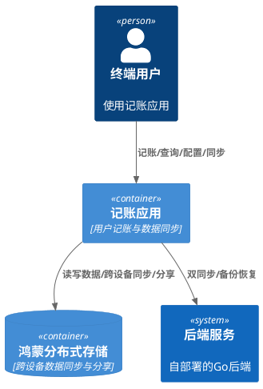

# **4. DFX约束**

本章节目的是前置定义非功能性红线。

## **4.1 性能**

| 指标 | 约束 |
|------|------|
| 页面加载时间 | ≤1s |
| 操作响应时间 | ≤500ms |
| 数据同步时间 | ≤3s |

## **4.2 可靠性**

| 指标 | 约束 |
|------|------|
| 系统可用性 | ≥99.9% |
| 故障恢复时间 | ≤5min |

## **4.3 安全性**

| 指标 | 约束 |
|------|------|
| 数据加密 | 敏感数据加密存储 |
| 数据传输 | 数据传输使用HTTPS |
| 用户认证 | 用户登录时验证密码 |

## **4.4 可维护性**

| 指标 | 约束 |
|------|------|
| 日志规范 | 日志符合规范要求 |
| 异常处理 | 异常处理符合规范要求 |

## **4.5 兼容性**

| 指标 | 约束 |
|------|------|
| 设备支持 | 支持手机、平板、电脑、手表 |
| 系统版本 | 支持HarmonyOS Next及以上版本 |
| API版本 | 使用最新的HarmonyOS API |

# **5. 核心能力**

本章节描述组件对外提供的所有业务能力。

## **5.1 用户登录与注册**

### **5.1.1 业务规则**

1. **邮箱格式校验**
   a. 验收条件：[用户点击注册按钮] → [系统应当验证邮箱格式是否正确]
   b. Acceptance Criteria: [用户输入错误的邮箱格式] → [系统提示"邮箱格式不正确"]

2. **邮箱唯一性校验**
   a. 验收条件：[用户注册时输入的邮箱已被注册] → [系统应当提示"该邮箱已被注册"]

3. **手机号唯一性校验**
   a. 验收条件：[用户注册时输入的手机号已被注册] → [系统应当提示"该手机号已被注册"]

4. **登录校验**
   a. 验收条件：[用户点击登录按钮] → [系统应当验证用户输入的邮箱/手机号和密码是否正确]
   b. Acceptance Criteria: [用户输入错误的邮箱/手机号或密码] → [系统提示"邮箱/手机号或密码错误"]

5. **用户信息写入**
   a. 验收条件：[用户登录成功] → [系统应当将用户信息存储到鸿蒙分布式存储中]
   b. 验收条件：[用户登录成功且配置了后端服务] → [系统应当将用户信息同步到后端服务]

### **5.1.2 交互流程**

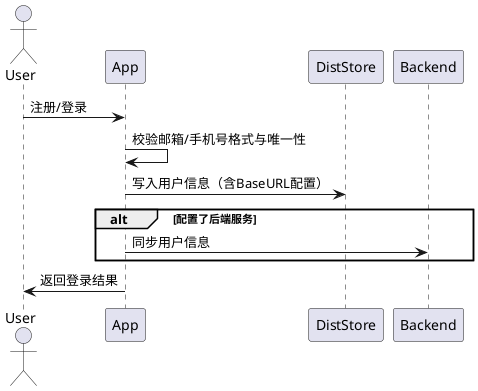

### **5.1.3 异常场景**

1. **邮箱格式错误**
   a. 触发条件：[注册时邮箱格式不正确]
   b. 系统行为：[阻止注册]
   c. 用户感知：[提示"邮箱格式不正确"]

2. **邮箱/手机号已被注册**
   a. 触发条件：[注册时邮箱或手机号已存在]
   b. 系统行为：[阻止注册]
   c. 用户感知：[提示"该邮箱已被注册"或"该手机号已被注册"]

3. **登录凭证错误**
   a. 触发条件：[登录时邮箱/手机号或密码不匹配]
   b. 系统行为：[拒绝登录]
   c. 用户感知：[提示"邮箱/手机号或密码错误"]

## **5.2 用户信息管理**

### **5.2.1 业务规则**

1. **昵称更新**
   a. 验收条件：[用户修改昵称] → [系统应当将昵称更新到鸿蒙分布式存储中]
   b. 验收条件：[用户修改昵称且配置了后端服务] → [系统应当将昵称同步到后端服务]

2. **头像大小限制**
   a. 验收条件：[用户上传的头像大小超过2MB] → [系统应当提示"头像大小不能超过2MB"]

3. **头像更新**
   a. 验收条件：[用户上传头像] → [系统应当将头像更新到鸿蒙分布式存储中]

### **5.2.2 交互流程**

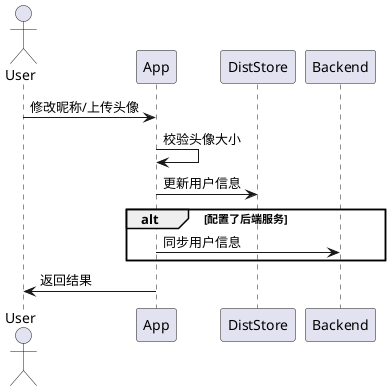

### **5.2.3 异常场景**

1. **头像超限**
   a. 触发条件：[上传头像文件超过2MB]
   b. 系统行为：[拒绝上传]
   c. 用户感知：[提示"头像大小不能超过2MB"]

## **5.3 收支记录管理**

### **5.3.1 业务规则**

1. **记录添加**
   a. 验收条件：[用户添加收支记录] → [系统应当将收支记录存储到鸿蒙分布式存储中]
   b. 验收条件：[用户添加收支记录且配置了后端服务] → [系统应当将收支记录同步到后端服务]

2. **金额校验**
   a. 验收条件：[用户添加收支记录时金额为空或0] → [系统应当提示"金额不能为空"]

3. **分类必选**
   a. 验收条件：[用户添加收支记录时未选择分类] → [系统应当提示"请选择分类"]

4. **账户必选**
   a. 验收条件：[用户添加收支记录时未选择账户] → [系统应当提示"请选择账户"]

5. **记录修改**
   a. 验收条件：[用户修改收支记录] → [系统应当更新鸿蒙分布式存储中的收支记录]
   b. 验收条件：[用户修改收支记录且配置了后端服务] → [系统应当将修改后的收支记录同步到后端服务]

6. **记录删除**
   a. 验收条件：[用户删除收支记录] → [系统应当从鸿蒙分布式存储中删除收支记录]
   b. 验收条件：[用户删除收支记录且配置了后端服务] → [系统应当从后端服务中删除收支记录]

### **5.3.2 交互流程**

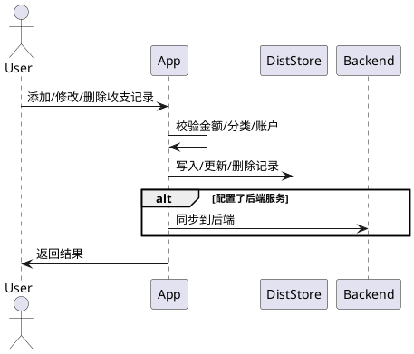

### **5.3.3 异常场景**

1. **必填项缺失**
   a. 触发条件：[金额为空或0/未选择分类/未选择账户]
   b. 系统行为：[拒绝保存]
   c. 用户感知：[提示"金额不能为空"/"请选择分类"/"请选择账户"]

## **5.4 记账分类管理**

### **5.4.1 业务规则**

1. **分类添加**
   a. 验收条件：[用户添加分类] → [系统应当将分类存储到鸿蒙分布式存储中]
   b. 验收条件：[用户添加分类且配置了后端服务] → [系统应当将分类同步到后端服务]

2. **分类名称非空**
   a. 验收条件：[用户添加分类时分类名称为空] → [系统应当提示"分类名称不能为空"]

3. **分类名称唯一**
   a. 验收条件：[用户添加分类时分类名称已存在] → [系统应当提示"分类名称已存在"]

4. **分类修改**
   a. 验收条件：[用户修改分类] → [系统应当更新鸿蒙分布式存储中的分类]
   b. 验收条件：[用户修改分类且配置了后端服务] → [系统应当将修改后的分类同步到后端服务]

5. **分类删除约束**
   a. 验收条件：[用户删除的分类下有关联的收支记录] → [系统应当提示"该分类下有收支记录，不能删除"]
   b. 验收条件：[用户删除分类且无关联收支] → [系统应当从鸿蒙分布式存储中删除分类]
   c. 验收条件：[用户删除分类且配置了后端服务] → [系统应当从后端服务中删除分类]

### **5.4.2 交互流程**

### **5.4.3 异常场景**

1. **名称为空**
   a. 触发条件：[分类名称为空]
   b. 系统行为：[拒绝保存]
   c. 用户感知：[提示"分类名称不能为空"]

2. **名称重复**
   a. 触发条件：[分类名称已存在]
   b. 系统行为：[拒绝保存]
   c. 用户感知：[提示"分类名称已存在"]

3. **关联记录存在**
   a. 触发条件：[删除的分类下有收支记录]
   b. 系统行为：[阻止删除]
   c. 用户感知：[提示"该分类下有收支记录，不能删除"]

## **5.5 记账标签管理**

### **5.5.1 业务规则**

1. **标签添加**
   a. 验收条件：[用户添加标签] → [系统应当将标签存储到鸿蒙分布式存储中]
   b. 验收条件：[用户添加标签且配置了后端服务] → [系统应当将标签同步到后端服务]

2. **标签名称非空**
   a. 验收条件：[用户添加标签时标签名称为空] → [系统应当提示"标签名称不能为空"]

3. **标签名称唯一**
   a. 验收条件：[用户添加标签时标签名称已存在] → [系统应当提示"标签名称已存在"]

4. **标签修改**
   a. 验收条件：[用户修改标签] → [系统应当更新鸿蒙分布式存储中的标签]
   b. 验收条件：[用户修改标签且配置了后端服务] → [系统应当将修改后的标签同步到后端服务]

5. **标签删除**
   a. 验收条件：[用户删除标签] → [系统应当从鸿蒙分布式存储中删除标签]
   b. 验收条件：[用户删除标签且配置了后端服务] → [系统应当从后端服务中删除标签]

### **5.5.2 交互流程**

### **5.5.3 异常场景**

1. **名称为空**
   a. 触发条件：[标签名称为空]
   b. 系统行为：[拒绝保存]
   c. 用户感知：[提示"标签名称不能为空"]

2. **名称重复**
   a. 触发条件：[标签名称已存在]
   b. 系统行为：[拒绝保存]
   c. 用户感知：[提示"标签名称已存在"]

## **5.6 账户管理**

### **5.6.1 业务规则**

1. **账户添加**
   a. 验收条件：[用户添加账户] → [系统应当将账户存储到鸿蒙分布式存储中]
   b. 验收条件：[用户添加账户且配置了后端服务] → [系统应当将账户同步到后端服务]

2. **账户名称非空**
   a. 验收条件：[用户添加账户时账户名称为空] → [系统应当提示"账户名称不能为空"]

3. **账户名称唯一**
   a. 验收条件：[用户添加账户时账户名称已存在] → [系统应当提示"账户名称已存在"]

4. **账户修改**
   a. 验收条件：[用户修改账户] → [系统应当更新鸿蒙分布式存储中的账户]
   b. 验收条件：[用户修改账户且配置了后端服务] → [系统应当将修改后的账户同步到后端服务]

5. **账户删除约束**
   a. 验收条件：[用户删除的账户下有关联的收支记录] → [系统应当提示"该账户下有收支记录，不能删除"]
   b. 验收条件：[用户删除账户且无关联收支] → [系统应当从鸿蒙分布式存储中删除账户]
   c. 验收条件：[用户删除账户且配置了后端服务] → [系统应当从后端服务中删除账户]

### **5.6.2 交互流程**

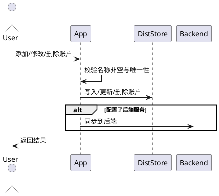

### **5.6.3 异常场景**

1. **名称为空**
   a. 触发条件：[账户名称为空]
   b. 系统行为：[拒绝保存]
   c. 用户感知：[提示"账户名称不能为空"]

2. **名称重复**
   a. 触发条件：[账户名称已存在]
   b. 系统行为：[拒绝保存]
   c. 用户感知：[提示"账户名称已存在"]

3. **关联记录存在**
   a. 触发条件：[删除的账户下有收支记录]
   b. 系统行为：[阻止删除]
   c. 用户感知：[提示"该账户下有收支记录，不能删除"]

## **5.7 记账查询**

### **5.7.1 业务规则**

1. **按日期查询**
   a. 验收条件：[用户按日期查询收支记录] → [系统应当返回指定日期范围内的收支记录]

2. **按分类查询**
   a. 验收条件：[用户按分类查询收支记录] → [系统应当返回指定分类下的收支记录]

3. **按标签查询**
   a. 验收条件：[用户按标签查询收支记录] → [系统应当返回指定标签下的收支记录]

4. **按账户查询**
   a. 验收条件：[用户按账户查询收支记录] → [系统应当返回指定账户下的收支记录]

5. **多条件组合查询**
   a. 验收条件：[用户同时按多个条件查询收支记录] → [系统应当返回满足所有条件的收支记录]

### **5.7.2 交互流程**

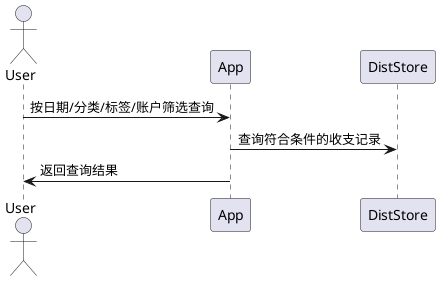

## **5.8 记账统计**

### **5.8.1 业务规则**

1. **今日统计**
   a. 验收条件：[用户查看今日收支统计] → [系统应当返回今日的总收入、总支出和收支明细]

2. **本月统计**
   a. 验收条件：[用户查看本月收支统计] → [系统应当返回本月总收入、总支出和收支明细]

3. **本年统计**
   a. 验收条件：[用户查看本年收支统计] → [系统应当返回本年总收入、总支出和收支明细]

4. **自定义日期范围统计**
   a. 验收条件：[用户查看自定义日期范围收支统计] → [系统应当返回指定日期范围内的总收入、总支出和收支明细]

5. **按分类汇总**
   a. 验收条件：[用户查看收支统计] → [系统应当按分类汇总收入和支出]

6. **按账户汇总**
   a. 验收条件：[用户查看收支统计] → [系统应当按账户汇总收入和支出]

### **5.8.2 交互流程**

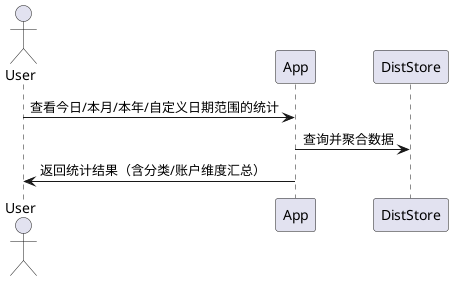

## **5.9 后端同步**

### **5.9.1 业务规则**

1. **双同步策略**
   a. 验收条件：[用户配置了后端服务] → [系统应当将记账数据同步到后端服务]

2. **变更同步**
   a. 验收条件：[用户添加或修改记账数据] → [系统应当将记账数据同步到后端服务]

3. **同步失败容错**
   a. 验收条件：[后端服务同步失败] → [系统应当将记账数据存储到鸿蒙分布式存储中，并提示"同步失败，数据已保存到本地"]

4. **后端恢复**
   a. 验收条件：[用户从后端服务恢复数据] → [系统应当将后端服务中的数据恢复到鸿蒙分布式存储中]

5. **冲突解决**
   a. 验收条件：[用户从后端服务恢复数据时本地数据与后端数据冲突] → [系统应当提示用户选择保留本地数据还是后端数据]

### **5.9.2 交互流程**

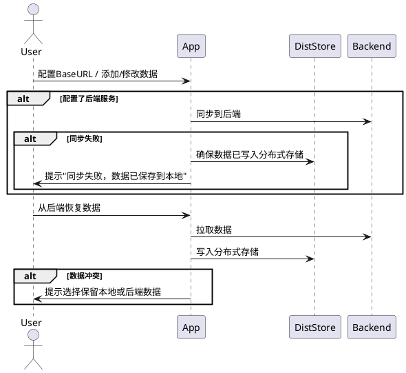

### **5.9.3 异常场景**

1. **后端同步失败**
   a. 触发条件：[后端服务不可用或返回错误]
   b. 系统行为：[确保分布式存储持久化完成]
   c. 用户感知：[提示"同步失败，数据已保存到本地"]

2. **数据冲突**
   a. 触发条件：[恢复时本地与后端数据不一致]
   b. 系统行为：[暂停写入，等待用户选择]
   c. 用户感知：[提示选择保留本地或后端数据]

## **5.10 分布式同步**

### **5.10.1 业务规则**

1. **跨设备同步**
   a. 验收条件：[用户在一台设备上添加或修改记账数据] → [系统应当自动同步到其他设备]

2. **跨设备删除同步**
   a. 验收条件：[用户在一台设备上删除记账数据] → [系统应当自动从其他设备删除]

3. **冲突处理**
   a. 验收条件：[多台设备同时修改同一笔记账数据] → [系统应当提示用户数据冲突，并保留最后修改的数据]

### **5.10.2 交互流程**

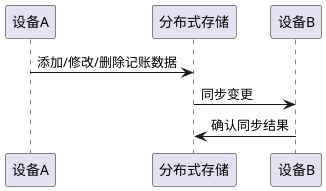

### **5.10.3 异常场景**

1. **并发冲突**
   a. 触发条件：[多台设备同时修改同一笔记账数据]
   b. 系统行为：[保留最后修改的数据]
   c. 用户感知：[提示数据冲突]

## **5.11 BaseURL配置**

### **5.11.1 业务规则**

1. **首次引导**
   a. 验收条件：[用户首次打开应用] → [系统应当显示后端服务配置页面]

2. **单同步模式**
   a. 验收条件：[用户未配置后端服务] → [系统应当使用鸿蒙分布式存储存储记账数据]

3. **双同步模式**
   a. 验收条件：[用户配置了后端服务] → [系统应当将记账数据存储到鸿蒙分布式存储和后端服务]

4. **连通性校验**
   a. 验收条件：[用户配置后端服务] → [系统应当验证后端服务地址是否可访问]

5. **不可访问提示**
   a. 验收条件：[后端服务地址不可访问] → [系统应当提示"后端服务地址不可访问，请检查地址是否正确"]

6. **切换后端同步**
   a. 验收条件：[用户修改后端服务地址] → [系统应当将本地数据同步到新的后端服务]

### **5.11.2 交互流程**

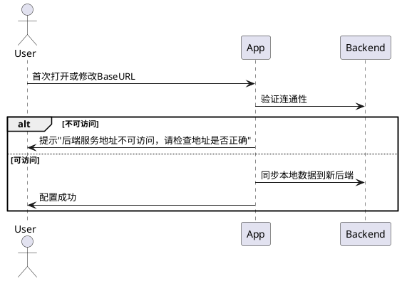

### **5.11.3 异常场景**

1. **后端不可访问**
   a. 触发条件：[BaseURL不可访问]
   b. 系统行为：[阻止保存配置]
   c. 用户感知：[提示"后端服务地址不可访问，请检查地址是否正确"]

## **5.12 数据分享**

### **5.12.1 业务规则**

1. **发起分享**
   a. 验收条件：[用户发起数据分享] → [系统应当通过鸿蒙分布式存储生成分享链接或令牌]

2. **接受分享**
   a. 验收条件：[其他用户接受分享] → [系统应当将共享的记账数据合并到鸿蒙分布式存储中]

3. **分享冲突**
   a. 验收条件：[分享的数据与本地数据冲突] → [系统应当提示用户选择覆盖或合并]

### **5.12.2 交互流程**

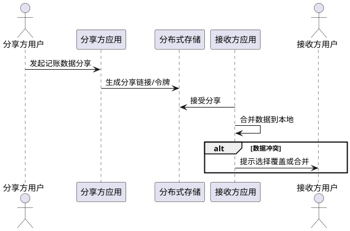

### **5.12.3 异常场景**

1. **分享冲突**
   a. 触发条件：[接收分享时本地存在冲突数据]
   b. 系统行为：[暂停写入，等待用户选择]
   c. 用户感知：[提示选择覆盖或合并]

# **6. 数据约束**

本章节目的是定义核心领域对象的逻辑约束。

## **6.1 用户信息**

1. **邮箱**：必须符合标准邮箱格式；全局唯一。
2. **手机号**：必须为11位数字；全局唯一。
3. **昵称**：长度限制1-32字符；允许中英文、数字、常见符号。
4. **头像**：格式支持jpg/png；大小不超过2MB。

## **6.2 收支记录**

1. **金额**：必须大于0；保留两位小数。
2. **日期**：必须为有效日期；默认为当前日期。
3. **分类**：必填；关联到已存在的分类ID。
4. **标签**：选填；关联到已存在的标签ID。
5. **账户**：必填；关联到已存在的账户ID。
6. **备注**：选填；长度限制0-256字符。

## **6.3 记账分类**

1. **分类名称**：必填；长度1-32字符；同一用户下唯一。
2. **分类类型**：必须为"收入"或"支出"。
3. **图标**：选填；关联到已定义的图标ID。

## **6.4 记账标签**

1. **标签名称**：必填；长度1-32字符；同一用户下唯一。
2. **颜色**：选填；颜色值。

## **6.5 账户**

1. **账户名称**：必填；长度1-32字符；同一用户下唯一。
2. **账户类型**：必须为银行卡、现金、微信、支付宝等预定义类型之一。
3. **初始余额**：必须大于等于0；保留两位小数。

## **6.6 BaseURL配置**

1. **BaseURL**：选填；必须为有效的HTTP/HTTPS URL；全局唯一。
